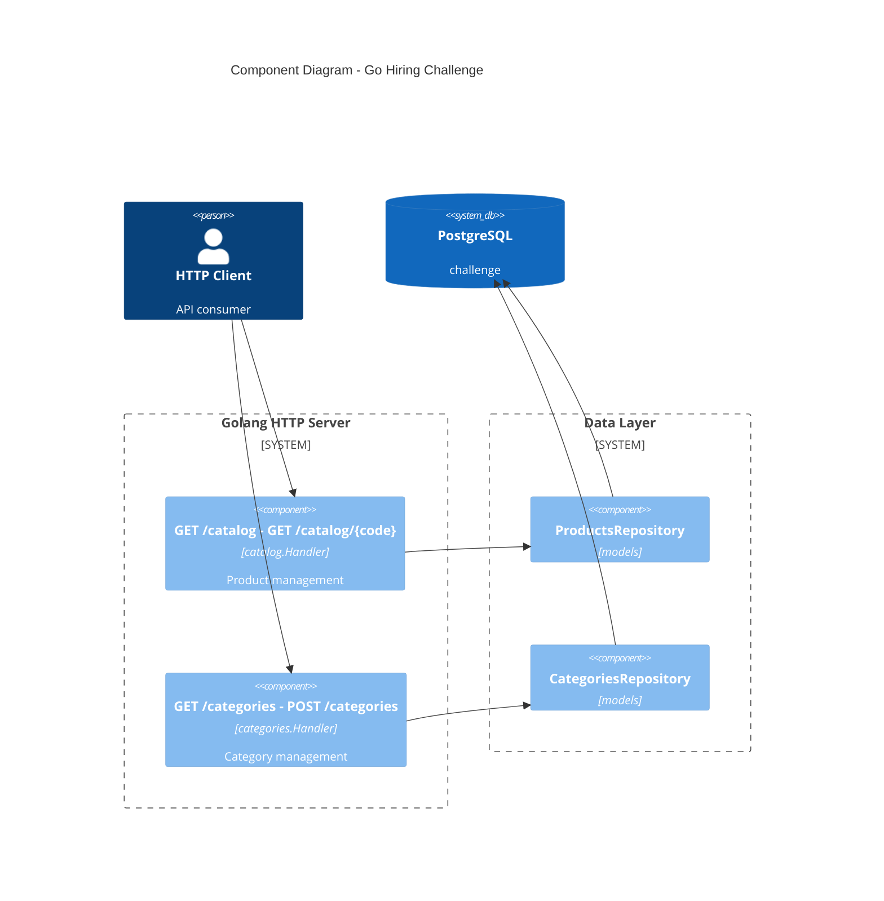

# Component Diagram

```mermaid
C4Component
    title Component Diagram - Go Hiring Challenge

    Person(client, "HTTP Client", "API consumer")

    System_Boundary(server, "Golang HTTP Server") {
        Component(catalog, "GET /catalog - GET /catalog/{code}", "catalog.Handler", "Product management")
        Component(categories, "GET /categories - POST /categories", "categories.Handler", "Category management")
    }

    System_Boundary(db_layer, "Data Layer") {
        Component(prod_repo, "ProductsRepository", "models", "")
        Component(cat_repo, "CategoriesRepository", "models", "")
    }

    SystemDb(postgres, "PostgreSQL", "challenge")

    Rel(client, catalog, "")
    Rel(client, categories, "")
    Rel(catalog, prod_repo, "")
    Rel(categories, cat_repo, "")
    Rel(prod_repo, postgres, "")
    Rel(cat_repo, postgres, "")
```
