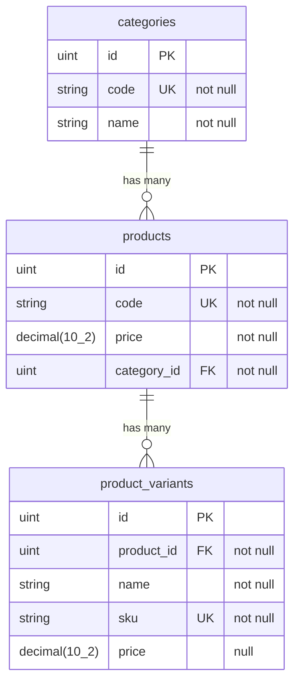

# Database Model Diagram

```mermaid
erDiagram
    categories {
        uint   id   PK
        string code UK "not null"
        string name     "not null"
    }

    products {
        uint            id          PK
        string          code        UK "not null"
        decimal(10_2)   price          "not null"
        uint            category_id FK "not null"
    }

    product_variants {
        uint            id         PK
        uint            product_id FK "not null"
        string          name          "not null"
        string          sku        UK "not null"
        decimal(10_2)   price         "null"
    }

    categories ||--o{ products        : "has many"
    products   ||--o{ product_variants : "has many"
```
